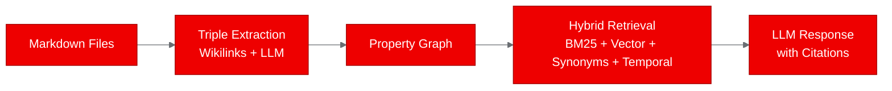
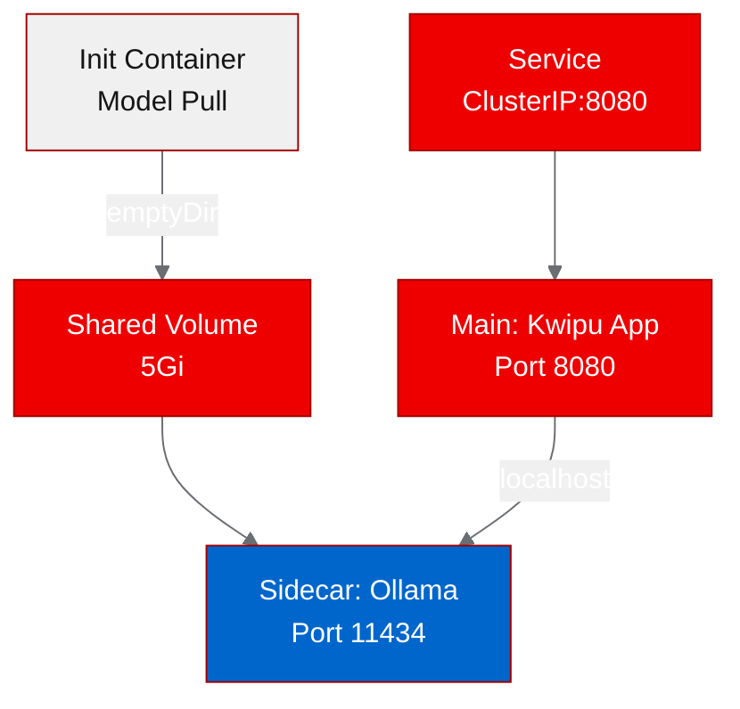

## Deploying a Graph RAG engine on Red Hat OpenShift AI with Ollama

We containerized Kwipu, a Graph RAG engine that turns Markdown knowledge bases into queryable graphs, and deployed it on [Red Hat OpenShift AI](https://www.redhat.com/en/technologies/cloud-computing/openshift/openshift-ai) with Ollama as a sidecar for local LLM inference. The multi-container deployment worked, but CPU-only inference proved too slow for practical use. Here's what we learned about running RAG pipelines with local LLM backends on OpenShift.

### What is Kwipu?

Kwipu is a local Graph RAG engine that processes Markdown files (designed for Obsidian vaults) into a property graph. It extracts knowledge triples from wikilinks and YAML frontmatter, then uses an LLM to find additional entity-relation-entity connections. At query time, it combines four retrieval strategies: LLM synonym expansion, vector similarity, BM25 keyword scoring, and temporal metadata matching.

The architecture makes Kwipu interesting for enterprise knowledge management: all inference stays local (no API keys, no data leaving the cluster), and the graph structure captures relationships that flat vector search misses.

### The multi-container approach

Kwipu depends on Ollama for both LLM inference and embedding generation. On OpenShift, we deployed them as a multi-container pod: the Kwipu application as the main container and Ollama as a sidecar, communicating over localhost.

A key challenge was Ollama's startup behavior on OpenShift. Ollama writes its configuration to `$HOME/.ollama`, but OpenShift runs containers with random UIDs that have no writable home directory. The fix: set the `HOME` and `OLLAMA_MODELS` environment variables to point at an emptyDir volume.

We also needed an init container to pull models before the main containers started. The init container starts Ollama, pulls the qwen2.5:1.5b LLM model and the nomic-embed-text embedding model, then shuts down. The main Ollama sidecar picks up the cached models from the shared volume.

### Containerizing with Red Hat Universal Base Image

We used the UBI 9 Python 3.12 image for the Kwipu container. The application needed only eight pip packages (LlamaIndex core, Ollama integrations, watchdog, rich, and the Model Context Protocol library), plus a lightweight HTTP wrapper to expose health, status, and query endpoints.

Since Kwipu is a CLI tool with no built-in HTTP server, we wrote a wrapper using Python's standard library `http.server` module. The server starts immediately and responds to health checks while the graph builds in a background thread. This separation means the pod passes readiness probes before the computationally expensive graph construction completes.

### What worked and what didn't

The deployment infrastructure worked well. The multi-container pod started correctly: init container pulled models, Ollama launched and served on localhost:11434, and the Kwipu application connected to Ollama and began processing the eight example Markdown files.

The health and status endpoints responded immediately. The graph pre-processing extracted 72 structural triples from the wikilinks and frontmatter in under a second.

What didn't work was the LLM extraction phase. Running qwen2.5:1.5b on CPU produced inference speeds of 0.46 tokens per second. Processing eight small documents took over 30 minutes before the asyncio event loop timed out. The graph query endpoint never became functional because the graph never finished building.

| Test | Result | Detail |
|------|--------|--------|
| Health check | PASS | HTTP server responsive, service metadata correct |
| Status check | PASS | Ollama URL and knowledge directory confirmed |
| Graph query | FAIL | Graph build incomplete: CPU inference too slow |

### Lessons for RAG deployments on Red Hat OpenShift AI

This proof of concept validates the deployment pattern but highlights a hard requirement: GPU acceleration for local LLM inference. Specific takeaways:

**Multi-container RAG pods work.** The init container plus sidecar pattern is a clean way to deploy applications that depend on LLM runtimes. OpenShift handles the container orchestration, shared volumes, and networking correctly.

**Ollama needs OpenShift-specific environment tuning.** The `HOME` and `OLLAMA_MODELS` environment variables must point to writable storage. This is a common issue for any application that assumes a traditional Unix home directory.

**CPU-only LLM inference is not viable for graph extraction.** At 0.46 tokens per second, even a small 1.5 billion parameter model cannot process a modest knowledge base in reasonable time. GPU nodes or an external inference service (such as [Red Hat AI Inference Server](https://www.redhat.com/en/technologies/cloud-computing/openshift/openshift-ai)) would resolve this.

**Persistent graph storage matters.** Without a PersistentVolumeClaim for the graph index, every pod restart triggers a full rebuild. Production deployments should persist the `storage_graph/` directory.

### Try it yourself

The deployment artifacts are on the [autopoc-artifacts branch](https://github.com/aicatalyst-team/Kwipu/tree/autopoc-artifacts): UBI Dockerfile, Kubernetes manifests with Ollama sidecar, test script, and the full report. If you have GPU nodes available on your cluster, modify the Ollama container resources to request `nvidia.com/gpu: 1` for dramatically better performance.

Explore [Open Data Hub](https://opendatahub.io/) for the upstream community project, or check out the [Red Hat AI developer resources](https://developers.redhat.com/topics/ai) for more RAG deployment patterns on OpenShift AI.
