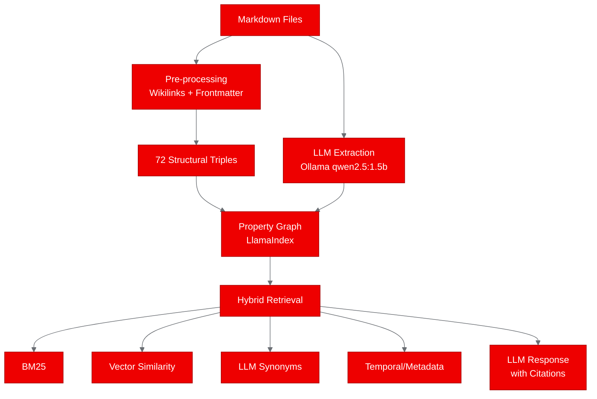
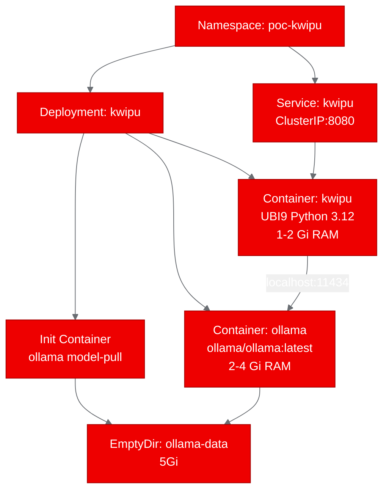

# PoC Report: Kwipu (Graph RAG over Markdown)

## Executive Summary

Kwipu, a Graph RAG engine that combines knowledge graph extraction with hybrid retrieval over Markdown files, was containerized using UBI9 Python 3.12 and deployed on Red Hat OpenShift AI with an Ollama sidecar for local LLM inference. The health and status endpoints passed (2/3 scenarios). The graph query test failed because CPU-only Ollama inference at 0.46 tokens/second caused the asyncio event loop to close before completing the graph build. GPU acceleration would resolve this issue.

## Project Analysis

- **Repository**: `https://github.com/benmaster82/Kwipu`
- **Fork**: `https://github.com/aicatalyst-team/Kwipu`
- **Description**: Kwipu is a local Graph RAG engine over Markdown files. It extracts knowledge triples from wikilinks and YAML frontmatter, builds a property graph using LlamaIndex, and uses hybrid retrieval (LLM synonyms, vector similarity, BM25, temporal) to answer natural-language questions.

| Component | Language | Build System | ML Workload | Port |
|-----------|----------|-------------|-------------|------|
| kwipu | Python | pip | Yes (LlamaIndex + Ollama) | 8080 (via HTTP wrapper) |

- **Classification**: rag
- **Technologies**: Python 3.12, LlamaIndex, Ollama, Graph RAG, BM25, Vector Search

## Test Results

| Scenario | Status | Duration | Details |
|----------|--------|----------|---------|
| health-check | PASS | 0.02s | HTTP 200, service responding |
| status-check | PASS | 0.00s | Configuration confirmed: Ollama URL, knowledge dir |
| graph-query | FAIL | 40.03s | Graph not ready: asyncio event loop closed during CPU-only LLM extraction |

## Infrastructure Deployed

- **Namespace**: `poc-kwipu`
- **Container Images**: `quay.io/aicatalyst/kwipu:latest`, `docker.io/ollama/ollama:latest`
- **Multi-container Pod**: Kwipu app + Ollama sidecar + init container for model pull
- **Models**: qwen2.5:1.5b (LLM), nomic-embed-text (embeddings)
- **Total Pod Resources**: ~3Gi RAM request, ~6Gi limit

## Key Findings

1. **Multi-container RAG deployment works**: The Kwipu + Ollama sidecar pattern successfully deployed. The init container pulled models, and both containers started correctly.

2. **OpenShift permission fix for Ollama**: Ollama defaults to writing to `$HOME/.ollama`. On OpenShift with random UIDs, this directory isn't writable. Fixed by setting `OLLAMA_MODELS` and `HOME` env vars to point at the emptyDir volume.

3. **CPU inference is prohibitively slow**: At 0.46 tokens/second, graph extraction for 8 small documents took over 30 minutes and still failed. GPU acceleration is mandatory for production use.

4. **Asyncio threading issue**: Running LlamaIndex's async operations in a background thread caused the event loop to close after extended operation. This needs `nest_asyncio` to be applied correctly or the graph build to happen synchronously before starting the HTTP server.

## Recommendations

- **GPU required**: This workload needs GPU acceleration for practical use. CPU-only inference is not viable.
- **Sync graph build**: Move graph initialization to before server start, or use a proper async approach.
- **Persistent storage**: Use PVCs for the graph storage to avoid rebuilding on pod restart.
- **Readiness probe**: Make the readiness probe conditional on `graph_ready` status.

## Appendix

- Fork: `https://github.com/aicatalyst-team/Kwipu`
- Image: `quay.io/aicatalyst/kwipu:latest`
- Kubernetes Manifests: `kubernetes/`
- Test Script: `poc_test.py`
